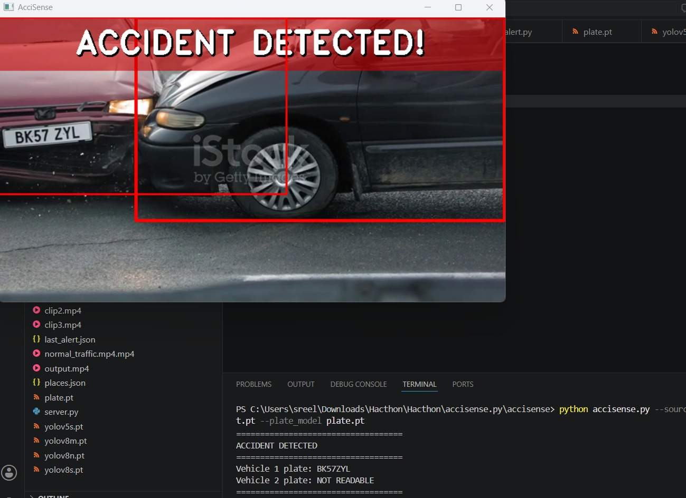
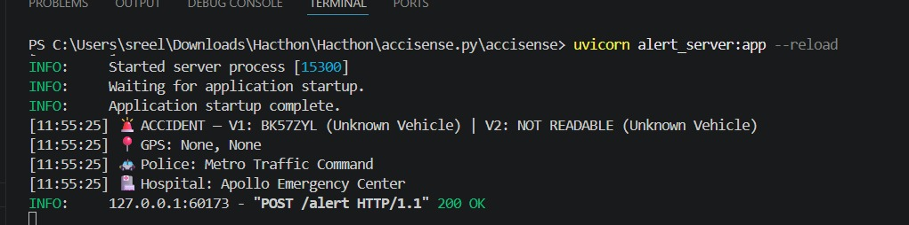
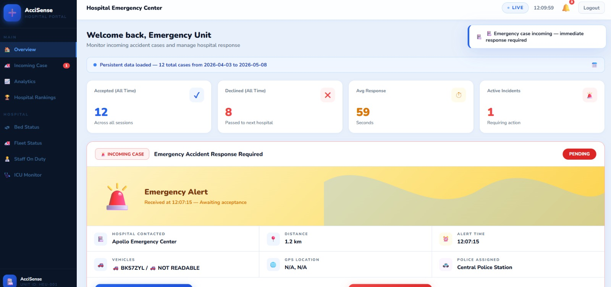
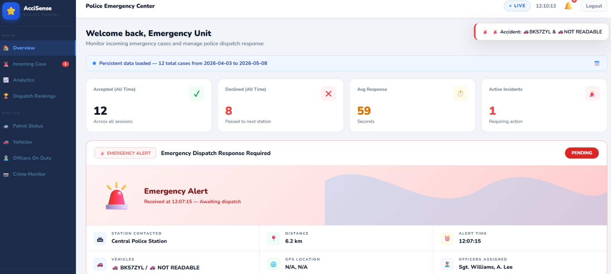

# AcciSense: A Deep Visual Learning Framework for Instant Road Accident Detection and Alert Generation.

## Overview

AcciSense is an AI-powered road accident detection and emergency alert generation system developed as a proof of concept. The system uses deep learning models to analyze prerecorded traffic videos that simulate CCTV footage, automatically detect road accidents, extract vehicle number plate information, and generate emergency alerts for nearby hospitals and police stations. The project demonstrates how AI can automate accident detection and emergency response when integrated with live surveillance systems, reducing dependency on manual reporting and showcasing its potential to improve emergency response time and public safety.

## Demo

The project demonstrates the complete workflow using prerecorded traffic videos that simulate CCTV footage:

- Accident Detection
- Vehicle Number Plate Recognition
- Emergency Alert Generation
- Hospital Dashboard
- Police Dashboard

## Problem Statement

Road accidents often result in severe injuries and fatalities because emergency services are not informed immediately. Existing systems rely heavily on eyewitness reporting, leading to delays in ambulance dispatch and police response.

AcciSense addresses this challenge by providing an automated accident detection and notification framework designed for future integration with CCTV surveillance systems. The current implementation validates the concept using prerecorded traffic videos.


## Objectives

- Detect road accidents automatically from traffic video feeds.
- Reduce emergency response time.
- Send instant alerts to nearby hospitals and police stations.
- Improve ambulance dispatch efficiency.
- Minimize false alerts through multi-frame analysis.


## Key Features

- Automated accident detection from traffic video feeds.
- Vehicle number plate recognition.
- Automatic emergency alert generation.
- Hospital notification system.
- Police control room notification.
- Automated alert forwarding to alternate hospitals when ambulance services are unavailable.
- Voice-based emergency alert generation.
- Continuous analysis of traffic video streams.


## System Workflow

1. Traffic video feed (or prerecorded CCTV-simulated video) is processed continuously.
2. Deep learning models detect road accidents.
3. Vehicle number plate information is extracted.
4. Emergency alerts are generated automatically.
5. Nearby hospitals receive ambulance requests.
6. If a hospital declines due to ambulance unavailability, the alert is forwarded to the next nearest hospital.
7. Police control room receives accident details.
8. Emergency services are dispatched to the accident location.


## Technologies Used

- Python
- OpenCV
- YOLO-based Object Detection
- OCR for Number Plate Recognition
- FastAPI
- Uvicorn
- Computer Vision
- Deep Learning
- EasyOCR
- HTML
- CSS
- JavaScript

## Project Architecture

```text
Traffic Video
      │
      ▼
YOLO Accident Detection
      │
      ▼
Number Plate Recognition
      │
      ▼
Alert Generation
      │
 ┌────┴────┐
 ▼         ▼
Hospital  Police
```

## Project Structure

```text
ACCISENSE/
│
├── src/
├── config/
│   └── places.json
├── screenshots/
├── .gitignore
├── requirements.txt
└── README.md
```

## How to Run

### Install Dependencies

```bash
pip install -r requirements.txt
```

Step 1: Start Accident Detection

Open another terminal and run:
```bash
py accisense.py --source "clip1.mp4" --accident_model accident.pt --plate_model plate.pt
```

Step 2: Start the Alert Server

Open a terminal and run:
```bash
uvicorn alert_server:app --reload
```

Step 3: Access the Web Application

After both services start successfully, a localhost URL will be displayed in the terminal.
Open the generated localhost link in your browser to access the AcciSense web interface, monitor accident alerts, and view system updates in real time.
> **Note:** Model files (`accident.pt`, `plate.pt`) and sample videos are not included in this repository due to size limitations. Please provide your own trained models and sample traffic videos to run the project.

## Dataset

This project uses publicly available traffic accident videos sourced from the internet for demonstration and testing purposes. These prerecorded videos simulate CCTV surveillance footage and are used to validate the accident detection and emergency alert generation pipeline. No proprietary or real-time CCTV data is included in this repository.


## Screenshots

### Accident Detection


### Terminal Output


### Website Login


### Hospital Dashboard


### Police Dashboard



## Applications

- Smart City Infrastructure
- Highway Monitoring Systems
- Urban Traffic Management
- Emergency Response Systems
- Public Safety Monitoring


## Future Enhancements

- Improve accident detection accuracy using advanced AI models and larger datasets.
- Optimize frame processing speed for enhanced real-time performance.
- Develop a dedicated monitoring and reporting application.
- Deploy on edge devices such as Raspberry Pi and NVIDIA Jetson.
- Integrate with smart traffic management systems.


## Conclusion

AcciSense demonstrates an intelligent and automated framework for road accident detection and emergency alert generation. By leveraging deep learning and computer vision technologies, the system analyzes prerecorded traffic videos to detect accidents, extract vehicle number plate information, and generate emergency alerts. As a proof of concept, it showcases the potential of AI to reduce reporting delays, improve emergency response, and enhance public safety when integrated with live surveillance systems.

## Disclaimer

AcciSense is an academic proof-of-concept project developed as part of a Bachelor of Technology (B.Tech.) final-year project. The current implementation analyzes prerecorded traffic videos to demonstrate AI-based accident detection, vehicle number plate recognition, and emergency alert generation. Although the system is designed with future integration into live CCTV surveillance systems in mind, real-time CCTV deployment has not been implemented in this project.

## License

This project was developed as part of a Bachelor of Technology (B.Tech.) final-year academic project and is shared for educational and portfolio purposes only.

Copyright © 2026 AcciSense Team. All rights reserved.

The source code, documentation, and related materials may not be copied, modified, redistributed, or used for commercial purposes without prior written permission from the project authors.


## Team Members 

- R. Divya
- S. Pavithra
- S. Sreelaya


## Academic Project

Final Year B.Tech. Artificial Intelligence and Data Science Project
